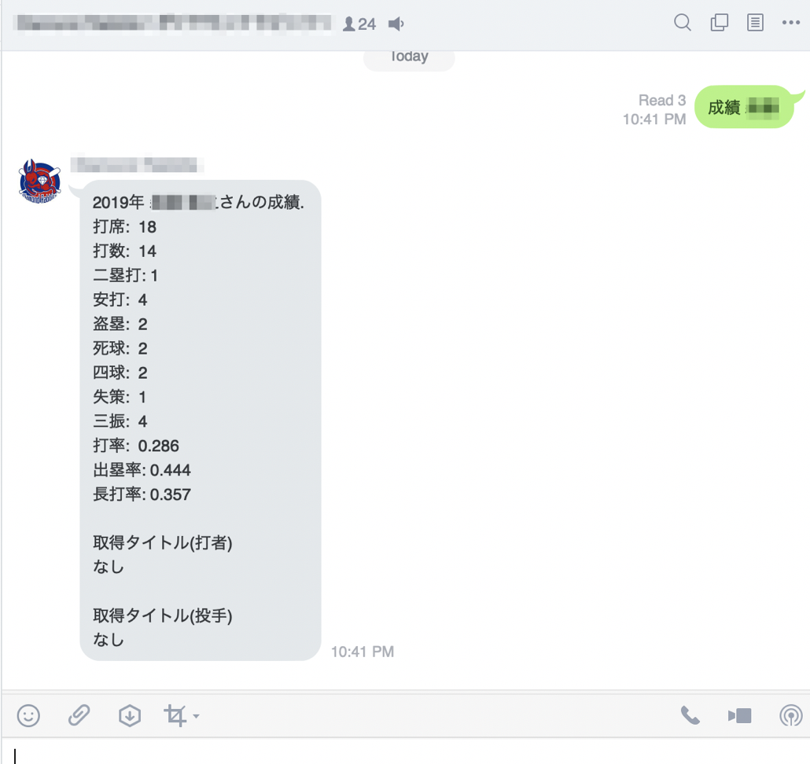

# baseball-scores-gas

スプレッドシートで草野球の成績を管理します

## 事前準備

### 1. スプレッドシートのコピー

- [こちらのスプレッドシート](https://docs.google.com/spreadsheets/d/1rXt5ZpL7rW0YtBgOsr0I1iuRA1R5BB8Pk6cUJDzPK6Q)をマイドライブにコピーします

### 2. スクリプトエディタを開く

1. [ツール] - [スクリプトエディタ] をクリックしてでスクリプトエディタを開く

### 3. スクリプトエディタの設定(ID の置換)

1. LINE.gs の `SPREAD_ID` を、コピーしたスプレッドシートの ID(https://docs.google.com/spreadsheets/d/以降の文字列)で置換する

### 4. スクリプトエディタの設定(トリガー設定)

1. [編集] - [現在のプロジェクトのトリガー] をクリックして、GAS コンソールを表示する
2. 右下の「トリガーを追加」クリック
3. スプレッドシート起動時に `onOpen()` を呼び出すようにトリガー設定  
   (特になにも変更せず登録すれば上記設定になるはず)
4. スプレッドシートをリロードすると、タブメニューの 1 番右に「コマンド」というメニューが出現するはず

### 5. LINE bot の設定
- もしあなたがチームメンバーの成績を LINE に連携させたい場合、  
LINE MessagingAPI のリプライ機能を使って、成績をLINEに連携させることができます

1. LINE bot を作成して、[LINE MessagingAPI](https://developers.line.biz/ja/services/messaging-api/)の Channel access token を入手してください。
2. 次に、スクリプトエディタのタブメニュー [公開] - [ウェブアプリケーションとして導入...] をクリックし、Webアプリケーションとして公開します
3. 公開すると発行されるURLを、LINE MessagingAPIのWebhookに設定します
4. LINE.gs の `CHANNEL_ACCESS_TOKEN` にLINE MessagingAPIのトークンを設定します

## 使い方

### チームメンバーの登録

- 「work」シートに選手リストを入力していきましょう
- 「work」シートに入力した選手リストは、「n 試合目」シートのプルダウンに表示されるようになります

### サマリシートにスコア合計を集計する

1. 準備ができたら、1 試合目のシートをクリアして、野手・投手の試合成績を入力していきましましょう
   - ところどころにスプレッドシート関数が登録されているのですべてをクリアしないように注意してください
2. 現在の試合数は、main.gs の `NUMBER_OF_MATCHS` という変数が知っています。
   - 試合数が増えた場合は「n 試合目」シートをコピーして、新たな試合結果シートを追加し、`NUMBER_OF_MATCHS` 変数に試合数合計を入力してください
3. 試合成績の入力が完了したら、タブメニューの [コマンド] - [成績集計] をクリックします
   - うまくいけば、「サマリ」シートの内容がクリアされ、新たな計算結果が出力されるはずです

### LINE bot に成績を答えさせる

- 事前準備で LINE bot の設定を行った場合は、LINE で集計結果を知ることができます
- LINE でヒットする選手名などは、LINE.gs の `members` 変数に登録します
  - Object の key にヒットして欲しい文字列を複数設定し、該当する正式な選手名を value に設定していきます

1. 任意の LINE グループに bot を招待します
2. 初期設定は、`成績 + membersに設定したヒットして欲しい文字列` がトリガーとなります
   - `成績 ほげ太郎1` と LINE に投稿した場合
     
